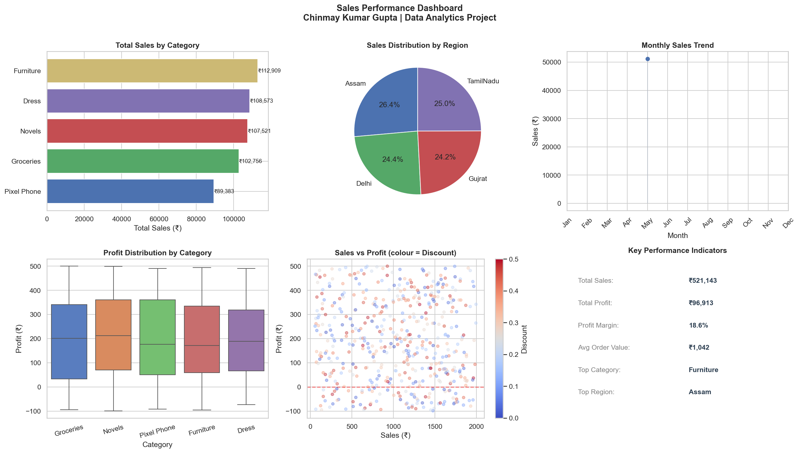

# Sales Performance Analysis

**Author:** Chinmay Kumar Gupta  
**College:** Harcourt Butler Technical University (HBTU), Kanpur  
**Tools:** Python, Pandas, Matplotlib, Seaborn  

---

## About this Project

I built this project to practice data analysis on retail sales data. The idea was simple — take raw order data and figure out what is actually driving revenue and where the business is losing money.

The dataset has 500 orders spread across product categories and Indian metro regions. I did the full process — loading the data, cleaning it, exploring patterns, building charts, and writing down what I found.


## Dataset

| Field | Description |
|---|---|
| Order_ID | Unique order identifier |
| Month | Month of order |
| Category | Product category (Pixel Phone, Dress, Furniture, Groceries, Novels) |
| Region | Sales region (Delhi, TamilNadu, Assam, Gujrat) |
| Sales | Order revenue (₹) |
| Profit | Order profit (₹) |
| Quantity | Units sold |
| Discount | Discount applied (0–0.5) |

---

## Key Findings

1. **Novels and Pixel Phones** are the top revenue-generating categories (₹1.24L and ₹1.15L respectively)
2. **Delhi region** leads sales with ₹1.43L — 26% of total revenue
3. **December** is the best-performing month (₹57,284) — holiday season effect
4. **38.8% of orders** have discounts above 30% — this is contributing to 16.8% loss-making orders
5. **High discounts are hurting profit margins** — scatter plot shows negative profit clusters at high discount values

---

## Business Recommendations

- **Reduce discounts above 30%** — nearly 17% of orders are loss-making, directly correlated with high discounts
- **Focus marketing spend on Delhi and Assam regions** — highest revenue contributors
- **Stock up on Novels and Pixel Phone before December** — peak season demand spike observed
- **Investigate Furniture category** — lowest revenue (₹80K) and high profit variance

---

## Dashboard Preview



---

## How to Run

```bash
git clone https://github.com/chinmay2705r/sales-data-analysis
cd sales-data-analysis
pip install pandas matplotlib seaborn numpy
python analysis.py
```

---

## Skills Demonstrated

`Python` `Pandas` `Matplotlib` `Seaborn` `EDA` `Data Cleaning` `Data Visualisation` `Business Insights` `KPI Analysis`
